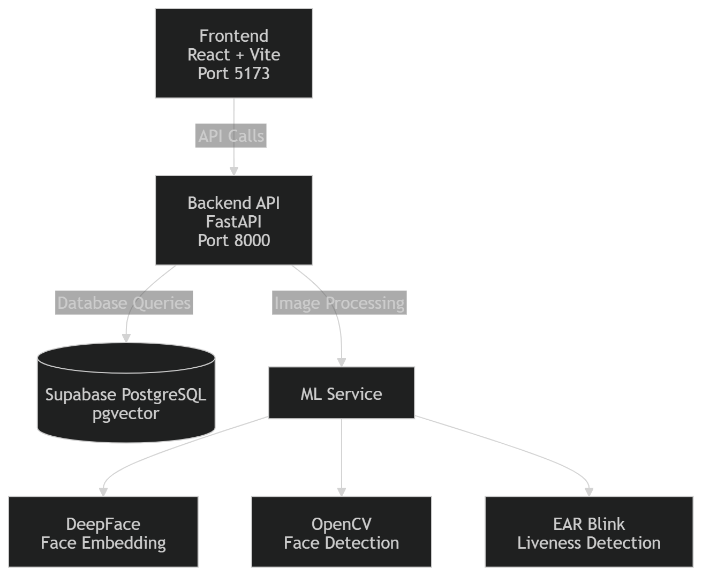

# 🎯 FaceAttend — Face Recognition Attendance System

A production-ready, real-time attendance system with **face recognition** and **liveness detection**.

  

---

## 📋 Table of Contents

- [Architecture](#architecture)
- [Prerequisites](#prerequisites)
- [Database Setup (Supabase)](#database-setup)
- [Backend Setup](#backend-setup)
- [Frontend Setup](#frontend-setup)
- [Running the System](#running-the-system)
- [API Reference](#api-reference)
- [How Liveness Detection Works](#liveness-detection)

---

## Architecture


---

## Prerequisites

- Python 3.10+
- Node.js 18+
- A Supabase project (already configured)
- (Optional) dlib for accurate liveness: see [dlib setup](#dlib-setup)

---

## Database Setup

### 1. Run the SQL Function

Open the **Supabase SQL Editor** and run the contents of `supabase_setup.sql`:

```sql
-- Creates the pgvector match_face() function required for face matching
```

This installs the `match_face(query_embedding, threshold)` RPC function.

---

## Backend Setup

```bash
cd backend

# 1. Create virtual environment
python -m venv venv

# Windows
venv\Scripts\activate

# macOS/Linux
source venv/bin/activate

# 2. Install dependencies
pip install -r requirements.txt

# 3. Configure environment (already set in .env)
# Verify backend/.env has correct SUPABASE_URL and SUPABASE_KEY

# 4. Start the server
uvicorn main:app --reload --port 8000
```

The API will be available at: http://localhost:8000  
Interactive docs: http://localhost:8000/docs

### dlib Setup (Optional — Recommended for Production)

dlib provides more accurate liveness detection. If `dlib` is not installed, OpenCV fallback is used automatically.

**Windows with Visual Studio Build Tools:**
```bash
# Install cmake first
pip install cmake
pip install dlib

# Download the 68-point landmark model (67MB)
# Source: http://dlib.net/files/shape_predictor_68_face_landmarks.dat.bz2
# Extract and place in: backend/shape_predictor_68_face_landmarks.dat
```

**Linux/macOS:**
```bash
sudo apt-get install cmake libboost-all-dev  # Linux
pip install dlib
```

Download link: http://dlib.net/files/shape_predictor_68_face_landmarks.dat.bz2

---

## Frontend Setup

```bash
cd frontend

# 1. Install dependencies
npm install

# 2. Start development server
npm run dev
```

Frontend will be available at: http://localhost:5173

---

## Running the System

Open **two terminals**:

**Terminal 1 — Backend:**
```bash
cd backend
venv\Scripts\activate  # Windows
uvicorn main:app --reload --port 8000
```

**Terminal 2 — Frontend:**
```bash
cd frontend
npm run dev
```

Then open http://localhost:5173

---

## First-Time Setup

1. **Register an Admin account** → go to `/register`, choose role "Admin"
2. **Log in** with your admin credentials
3. **Go to Admin Panel** → add other users via `/register` (or via Supabase dashboard)
4. **Register Faces** → in Admin Panel, click "Register Face" for each user → use webcam
5. **Mark Attendance** → users go to `/mark-attendance`, look at camera, and blink

---

## API Reference

### Auth
| Method | Endpoint | Description |
|--------|----------|-------------|
| POST | `/auth/register` | Register new user |
| POST | `/auth/login` | Login, returns JWT |
| GET  | `/auth/me` | Get current user |
| GET  | `/auth/users` | List all users (admin) |

### Face
| Method | Endpoint | Description |
|--------|----------|-------------|
| POST | `/face/register` | Register face embedding (admin) |
| POST | `/face/recognize` | Recognize face + liveness |
| POST | `/face/liveness-check` | Standalone liveness check |
| GET  | `/face/user/{id}` | Get user's registered faces |

### Attendance
| Method | Endpoint | Description |
|--------|----------|-------------|
| POST | `/attendance/mark` | Mark attendance |
| GET  | `/attendance/today` | Today's summary (admin) |
| GET  | `/attendance/list` | All records (admin) |
| GET  | `/attendance/user/{id}` | User's records |
| GET  | `/attendance/check/{id}` | Check if marked today |

---

## Liveness Detection

The system uses **Eye Aspect Ratio (EAR)** blink detection:

```
EAR = (|p2-p6| + |p3-p5|) / (2 * |p1-p4|)
```

Where p1–p6 are the 6 eye landmark coordinates from dlib's 68-point model.

- **EAR < 0.25** for 2+ consecutive frames → blink detected
- **1 blink** = liveness confirmed
- Without dlib: falls back to OpenCV Haar cascade eye detection

The frontend sends webcam frames every 400ms during liveness check. Once a blink is detected, face recognition runs automatically.

---

## Face Embedding

Uses **DeepFace with Facenet512** model:
- Input: any face image (JPEG/PNG or base64)
- Output: 512-dimensional float vector
- Stored in Supabase `face_data` table as `vector(512)`
- Matched using **cosine similarity** via pgvector

---

## Project Structure

```
face-attendance-system/
├── backend/
│   ├── main.py              # FastAPI entry point (port 8000)
│   ├── config.py            # Env vars + Supabase client
│   ├── database.py          # DB helpers + Supabase RPC
│   ├── auth/
│   │   ├── router.py        # /auth/* endpoints
│   │   └── utils.py         # JWT + bcrypt
│   ├── face/
│   │   ├── router.py        # /face/* endpoints
│   │   ├── encoder.py       # DeepFace Facenet512
│   │   └── liveness.py      # EAR blink detection
│   ├── attendance/
│   │   └── router.py        # /attendance/* endpoints
│   ├── requirements.txt
│   └── .env
│
├── frontend/
│   ├── src/
│   │   ├── App.jsx          # Router
│   │   ├── api/client.js    # Axios + JWT interceptor
│   │   ├── context/AuthContext.jsx
│   │   ├── pages/
│   │   │   ├── Login.jsx
│   │   │   ├── Register.jsx
│   │   │   ├── Dashboard.jsx
│   │   │   ├── MarkAttendance.jsx
│   │   │   └── AdminPanel.jsx
│   │   └── components/
│   │       ├── Navbar.jsx
│   │       ├── Webcam.jsx
│   │       ├── LivenessGuide.jsx
│   │       ├── AttendanceTable.jsx
│   │       └── ProtectedRoute.jsx
│   └── package.json
│
├── supabase_setup.sql       # Run this first in Supabase SQL editor
└── README.md
```

---

## Troubleshooting

| Issue | Fix |
|-------|-----|
| `dlib` install fails on Windows | Install Visual Studio Build Tools, then `pip install cmake dlib` |
| "No face detected" | Improve lighting, face closer to camera, ensure face_recognition model downloaded |
| pgvector RPC fails | Run `supabase_setup.sql` in Supabase SQL editor |
| CORS error | Ensure backend runs on port 8000, frontend on 5173 |
| DeepFace first run is slow | Downloads ~250MB Facenet model on first use — be patient |
| `already marked` 409 error | Expected — attendance can only be marked once per day |
